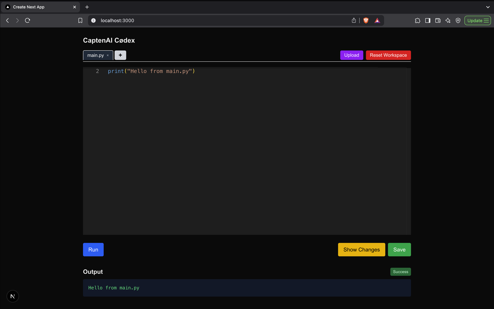
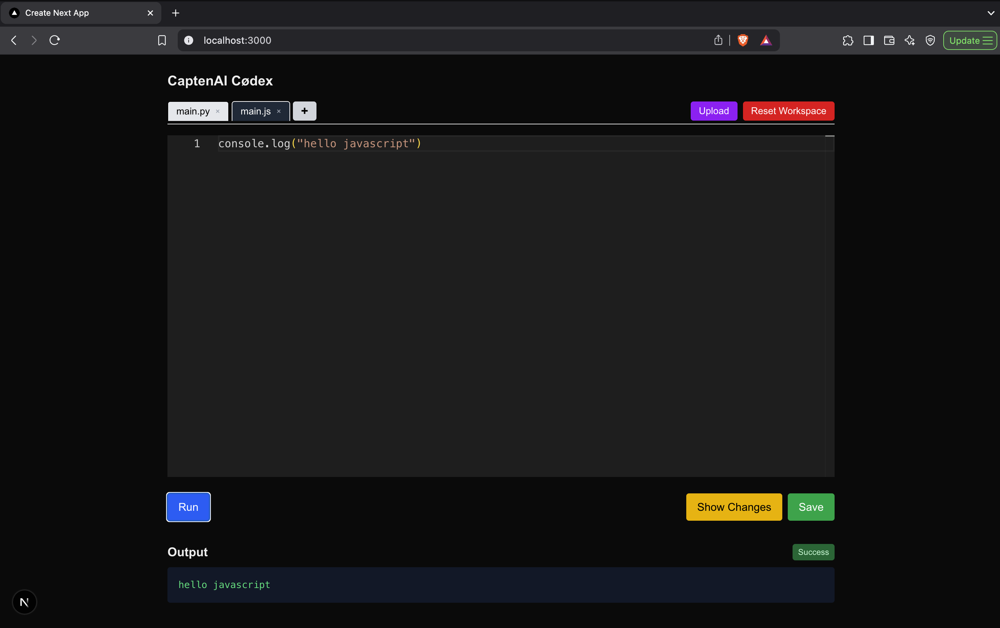
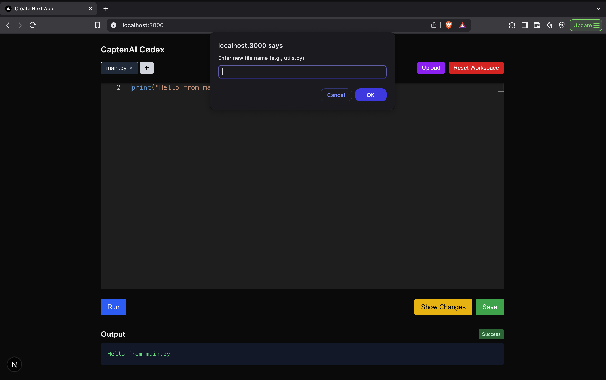
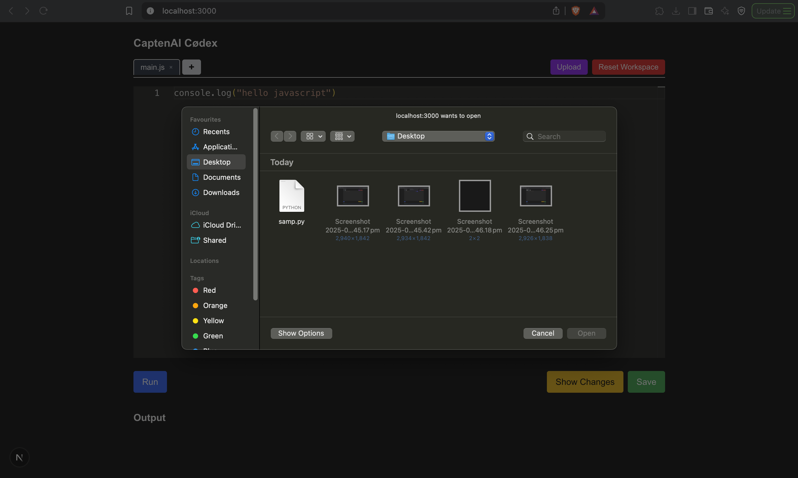
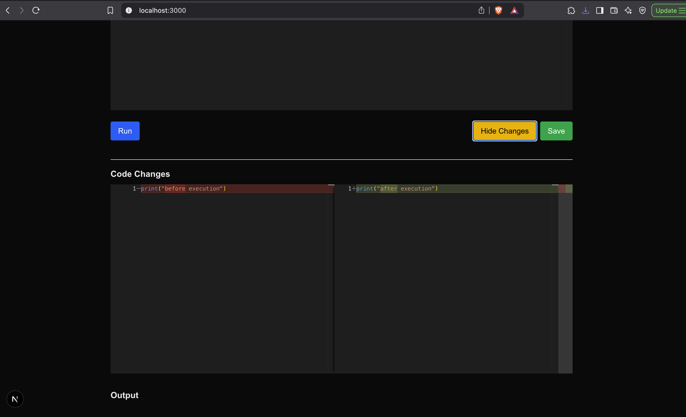
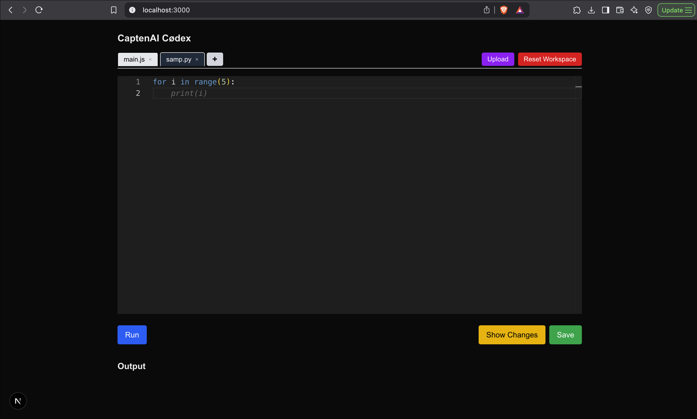

# 🚀 CaptenAI Codex – Monaco Code Playground

An intelligent, minimal, and professional multi-language code playground built with Monaco Editor and Gemini AI for inline suggestions.

---

## ✨ Features

- 📝 Multi-file editing with tabs (supports `.py` and `.js`)
- 💡 Gemini AI-powered inline code suggestions
- 🧪 Real-time **Python** and **JavaScript** code execution
- 📂 Upload, ➕ Create, and ❌ Close files
- 💾 Save your files locally
- 🧼 Reset the workspace
- 🧠 View code changes using **Monaco Diff Editor**
- 🔄 Persistent session using LocalStorage

---

## 📸 Screenshots

### Python Execution:
  

### JavaScript Execution:
  

### Creating New File:
  

### Uploading Existing File
 

### View Code Changes
  

### Gemini AI-powered inline code suggestions
  

---

